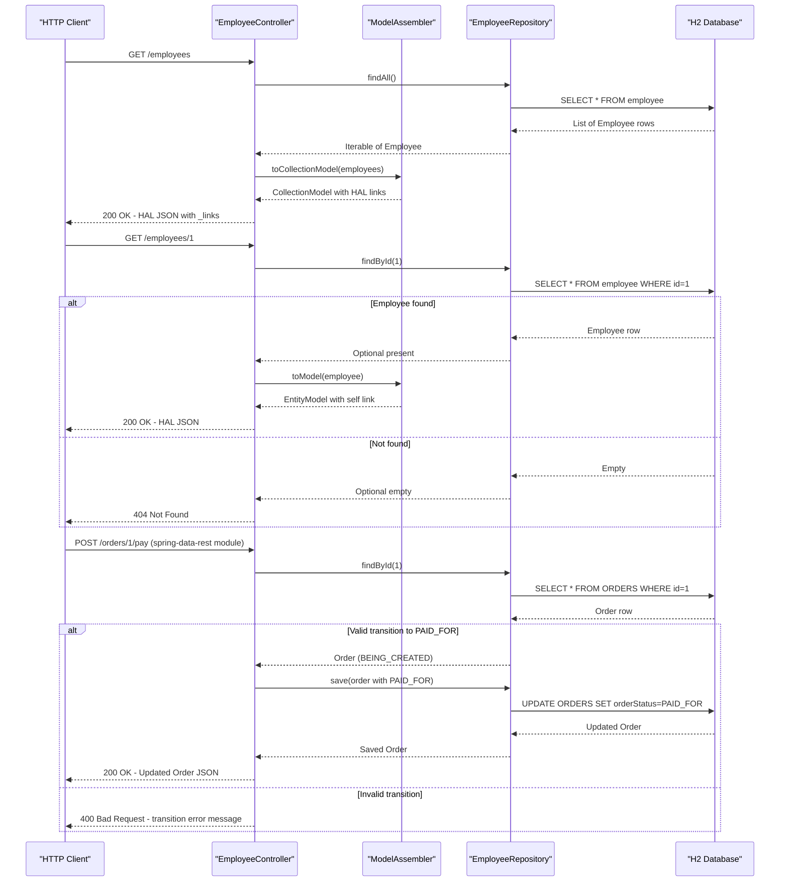

# API & Service Communication Contracts

This project exposes hypermedia-driven REST APIs across six independent Spring Boot example modules, demonstrating progressively advanced Spring HATEOAS patterns with a total of approximately 25 documented endpoints.

## Service Catalog

| Service | Port | Category | Purpose |
|---------|------|----------|---------|
| basics | 8080 (default) | Business | Minimal Spring HATEOAS example with GET-only employee endpoints |
| hypermedia | 8080 (default) | Business | Full hypermedia example with employees, managers, supervisors, and root link discovery |
| affordances | 8080 (default) | Business | HAL-FORMS example with affordances, full CRUD on employees |
| simplified | 8080 (default) | Business | Simplified assembler pattern with full CRUD on employees |
| api-evolution/original-server | 9000 | Business | Original API server (v1); exposes /employees for evolution demo |
| api-evolution/new-server | 9000 | Business | Evolved API server (v2) demonstrating backward-compatible API changes |
| api-evolution/original-client | 8080 (default) | Business | Client app consuming original-server via hypermedia REST |
| api-evolution/new-client | 8080 (default) | Business | Client app consuming new-server via hypermedia REST |
| spring-data-rest | 9000 | Business | Spring Data REST module with custom order state-machine transitions |

## API Endpoints Inventory

| Service | Method | Path | Request Type | Response Type |
|---------|--------|------|-------------|--------------|
| basics | GET | /employees | — | CollectionModel of EntityModel of Employee |
| basics | GET | /employees/{id} | Path: id (long) | EntityModel of Employee or 404 |
| hypermedia | GET | / | — | Root links (discovery) |
| hypermedia | GET | /employees | — | CollectionModel of EntityModel of Employee |
| hypermedia | GET | /employees/{id} | Path: id (long) | EntityModel of Employee or 404 |
| hypermedia | GET | /employees/detailed | — | CollectionModel of EntityModel of EmployeeWithManager |
| hypermedia | GET | /employees/{id}/detailed | Path: id (long) | EntityModel of EmployeeWithManager or 404 |
| hypermedia | GET | /managers | — | CollectionModel of EntityModel of Manager |
| hypermedia | GET | /managers/{id} | Path: id (long) | EntityModel of Manager or 404 |
| hypermedia | GET | /managers/{id}/employees | Path: id (long) | CollectionModel of EntityModel of Employee |
| hypermedia | GET | /employees/{id}/manager | Path: id (long) | EntityModel of Manager or 404 |
| hypermedia | GET | /supervisors/{id} | Path: id (long) | EntityModel of Supervisor or 404 |
| affordances | GET | /employees | — | CollectionModel of EntityModel of Employee (with HAL-FORMS affordances) |
| affordances | POST | /employees | Body: Employee | EntityModel of Employee (created) |
| affordances | GET | /employees/{id} | Path: id (long) | EntityModel of Employee or 404 |
| affordances | PUT | /employees/{id} | Path: id (long), Body: Employee | EntityModel of Employee (updated) |
| affordances | DELETE | /employees/{id} | Path: id (long) | 204 No Content |
| simplified | GET | /employees | — | CollectionModel of EntityModel of Employee |
| simplified | POST | /employees | Body: Employee | EntityModel of Employee (created) |
| simplified | GET | /employees/{id} | Path: id (long) | EntityModel of Employee or 404 |
| simplified | PUT | /employees/{id} | Path: id (long), Body: Employee | EntityModel of Employee (updated) |
| api-evolution/original-server | GET | / | — | Root links |
| api-evolution/original-server | GET | /employees | — | CollectionModel of EntityModel of Employee |
| api-evolution/original-server | POST | /employees | Body: Employee | EntityModel of Employee (created) |
| api-evolution/original-server | GET | /employees/{id} | Path: id (long) | EntityModel of Employee or 404 |
| api-evolution/new-server | GET | / | — | Root links |
| api-evolution/new-server | GET | /employees | — | CollectionModel of EntityModel of Employee |
| api-evolution/new-server | POST | /employees | Body: Employee | EntityModel of Employee (created) |
| api-evolution/new-server | GET | /employees/{id} | Path: id (long) | EntityModel of Employee or 404 |
| spring-data-rest | GET | /api/orders | — | Spring Data REST collection (HAL) |
| spring-data-rest | GET | /api/orders/{id} | Path: id (long) | Spring Data REST entity (HAL) |
| spring-data-rest | POST | /api/orders/{id}/pay | Path: id (long) | Updated Order or 400 |
| spring-data-rest | POST | /api/orders/{id}/cancel | Path: id (long) | Updated Order or 400 |
| spring-data-rest | POST | /api/orders/{id}/fulfill | Path: id (long) | Updated Order or 400 |

## Management & Observability Endpoints

| Service | Endpoint | Custom Metrics |
|---------|----------|---------------|
| All modules | None configured | None — no Spring Boot Actuator or custom metrics detected |

No Actuator dependency is included. No Micrometer, Prometheus, or tracing endpoints are exposed by any module.

## DTOs & Contracts

**Domain entities used directly as API responses** (no separate DTO layer):

- `Employee` — used as both persistence entity and API response body. Fields vary slightly by module (basics/affordances/simplified: `id`, `firstName`, `lastName`, `role`; hypermedia: `id`, `name`, `role`). Annotated with `@JsonIgnoreProperties(ignoreUnknown = true)` enabling forward-compatible deserialization. Mutable (Lombok `@Data`).
- `Manager` — hypermedia module entity / API response. Fields: `id`, `name`. `employees` collection is `@JsonIgnore` to prevent circular serialization. Mutable (Lombok `@Data`).
- `EmployeeWithManager` — composite view model (hypermedia module) that wraps an `Employee` and exposes manager details. Acts as a gateway-level aggregation DTO — combines data from both `Employee` and `Manager` without a separate service call.
- `Order` — spring-data-rest module entity / API response. Fields: `id`, `orderStatus` (enum), `description`. No immutability annotations; standard getters/setters.

**No OpenAPI/Swagger, protobuf, or GraphQL specifications are present.** Serialization is handled by Jackson (Jackson Databind, included transitively via `spring-boot-starter-hateoas`). HAL media type (`application/hal+json`) is the default; the affordances module additionally enables `application/paffordance+json` (HAL-FORMS) via `@EnableHypermediaSupport(type = HypermediaType.HAL_FORMS)`.

## Communication Patterns

**Synchronous (HTTP/REST only):** All inter-module communication is synchronous HTTP using Spring's `RestTemplate` configured with `HypermediaRestTemplateConfigurer` to support HAL link traversal. The `api-evolution` client modules call their respective server modules using HAL link navigation — clients follow `_links.self`, `_links.employees`, etc., rather than hardcoded paths.

**Asynchronous:** No message queues, event buses, Kafka, RabbitMQ, or pub/sub patterns are used.

**Resilience patterns:** No circuit breakers (Resilience4j, Hystrix), retry policies, or timeout configuration are present. No fallback behavior is implemented.

**Service discovery:** No Eureka, Consul, or Kubernetes-based service discovery. The api-evolution client modules connect to hardcoded URLs (`http://localhost:9000`).

**API gateway:** No API gateway. Each module is independently deployed.

**Security posture:** No authentication, authorization, or TLS is configured in any module. All endpoints are publicly accessible with no security checks. The `security` sub-module directory exists in the repository but contains no source code.

**Startup dependency chain:** The api-evolution client modules depend on their paired server being reachable at startup. No health-probe or wait mechanism is in place; clients will fail on first request if the server is not running.

## Service Technology Matrix

| Service | Web Framework | Data Access | Discovery | Gateway | Actuator | Cache | Metrics |
|---------|--------------|------------|-----------|---------|----------|-------|---------|
| basics | Spring MVC | Spring Data JPA / H2 | None | None | None | None | None |
| hypermedia | Spring MVC | Spring Data JPA / H2 | None | None | None | None | None |
| affordances | Spring MVC | Spring Data JPA / H2 | None | None | None | None | None |
| simplified | Spring MVC | Spring Data JPA / H2 | None | None | None | None | None |
| api-evolution/original-server | Spring MVC | Spring Data JPA / H2 | None | None | None | None | None |
| api-evolution/new-server | Spring MVC | Spring Data JPA / H2 | None | None | None | None | None |
| api-evolution/original-client | Spring MVC + RestTemplate | None | None | None | None | None | None |
| api-evolution/new-client | Spring MVC + RestTemplate | None | None | None | None | None | None |
| spring-data-rest | Spring Data REST + Spring MVC | Spring Data JPA / H2 | None | None | None | None | None |

## Service Communication Sequence

