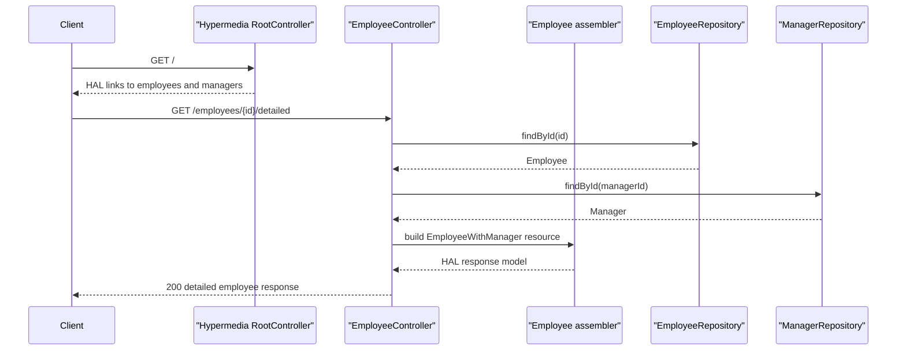

# API & Service Communication Contracts

This repository exposes several small HTTP APIs rather than a single deployable surface, and all communication is synchronous REST over HTTP. The examples emphasize hypermedia navigation, state-driven affordances, and a small client-to-server integration pattern in the api-evolution modules.

## Service Catalog

| Service | Port | Category | Purpose |
|---|---:|---|---|
| basics | 8080 default | Business | Read-only employee hypermedia example |
| simplified | 8080 default | Business | Employee CRUD sample with a simpler HATEOAS setup |
| hypermedia | 8080 default | Business | Rich employee and manager navigation with legacy compatibility links |
| affordances | 8080 default | API Layer | HAL FORMS example that advertises CRUD affordances |
| api-evolution original-server | 9000 | API Layer | Original employee API used by the original client |
| api-evolution new-server | 9000 | API Layer | Backward-compatible employee API used by the new client |
| api-evolution original-client | 8080 default | API Layer | MVC client that follows server links with Traverson |
| api-evolution new-client | 8080 default | API Layer | Updated MVC client for the evolved server API |
| spring-hateoas-and-spring-data-rest | 8080 default | Business | Order workflow sample that combines Spring Data REST and custom transition endpoints |
| commons | N/A | Infrastructure | Shared assembler library, not independently deployable |
| security | N/A | Infrastructure | Placeholder module with no API surface |

## API Endpoints Inventory

| Service | Method | Path | Request Type | Response Type |
|---|---|---|---|---|
| basics | GET | /employees | None | HAL collection of Employee resources |
| basics | GET | /employees/{id} | Path id | HAL Employee resource or 404 |
| simplified | GET | /employees | None | HAL collection of Employee resources |
| simplified | POST | /employees | Employee request body | 201 Created with Location header |
| simplified | GET | /employees/{id} | Path id | HAL Employee resource or 404 |
| simplified | PUT | /employees/{id} | Path id plus Employee request body | 204 No Content |
| hypermedia | GET | / | None | HAL root document with navigation links |
| hypermedia | GET | /employees | None | HAL collection of Employee resources |
| hypermedia | GET | /employees/{id} | Path id | HAL Employee resource |
| hypermedia | GET | /managers/{id}/employees | Path id | HAL collection of Employee resources |
| hypermedia | GET | /employees/detailed | None | Collection of EmployeeWithManager resources |
| hypermedia | GET | /employees/{id}/detailed | Path id | EmployeeWithManager resource |
| hypermedia | GET | /managers | None | HAL collection of Manager resources |
| hypermedia | GET | /managers/{id} | Path id | HAL Manager resource |
| hypermedia | GET | /employees/{id}/manager | Path id | HAL Manager resource |
| hypermedia | GET | /supervisors/{id} | Path id | Supervisor legacy DTO |
| affordances | GET | /employees | None | HAL FORMS employee collection |
| affordances | POST | /employees | Employee request body | 201 Created with Location header |
| affordances | GET | /employees/{id} | Path id | HAL FORMS employee resource |
| affordances | PUT | /employees/{id} | Path id plus Employee request body | 204 No Content |
| affordances | DELETE | /employees/{id} | Path id | 204 No Content |
| api-evolution original-server | GET | / | None | Root representation with employees link |
| api-evolution original-server | GET | /employees | None | Employee collection |
| api-evolution original-server | POST | /employees | Employee request body | 201 Created |
| api-evolution original-server | GET | /employees/{id} | Path id | Employee resource |
| api-evolution new-server | GET | / | None | Root representation with employees link |
| api-evolution new-server | GET | /employees | None | Employee collection |
| api-evolution new-server | POST | /employees | Employee request body | 201 Created |
| api-evolution new-server | GET | /employees/{id} | Path id | Employee resource |
| api-evolution original-client | GET | / | None | Thymeleaf page backed by remote employee collection |
| api-evolution original-client | POST | /employees | Form body | Redirect after remote employee creation |
| api-evolution new-client | GET | / | None | Thymeleaf page backed by remote employee collection |
| api-evolution new-client | POST | /employees | Form body | Redirect after remote employee creation |
| spring-hateoas-and-spring-data-rest | GET | /api/orders | None | Spring Data REST collection of orders |
| spring-hateoas-and-spring-data-rest | GET | /api/orders/{id} | Path id | Spring Data REST order resource |
| spring-hateoas-and-spring-data-rest | POST | /api/orders/{id}/pay | Path id | Updated Order resource or 400/404 |
| spring-hateoas-and-spring-data-rest | POST | /api/orders/{id}/cancel | Path id | Updated Order resource or 400/404 |
| spring-hateoas-and-spring-data-rest | POST | /api/orders/{id}/fulfill | Path id | Updated Order resource or 400/404 |

## Management & Observability Endpoints

| Service | Endpoint | Custom Metrics (if any) |
|---|---|---|
| All services | None detected | None |

## DTOs & Contracts

The service-level domain contracts are centered on `Employee`, `Manager`, and `Order` entities, each serialized through Spring HATEOAS resource wrappers rather than standalone OpenAPI contracts. `EmployeeWithManager` in the hypermedia module is the main composite response DTO, while `Supervisor` is a legacy compatibility DTO used to preserve an older contract shape. The client modules exchange `Employee` payloads with the server modules through Traverson-discovered links, and Lombok-generated value objects are used heavily, with immutable-style DTO behavior appearing primarily in representation wrappers rather than Java records.

## Communication Patterns

All discovered communication is synchronous. Most modules use direct controller-to-repository method calls inside a single Spring Boot process, while the api-evolution clients use Traverson over HTTP to discover and invoke the companion server endpoints at `http://localhost:9000`. There are no message brokers, async event handlers, service discovery clients, retries, circuit breakers, timeouts, or client-side load balancers configured. Startup availability is simple because each example is self-contained and seeds its own in-memory data on startup. Security posture is intentionally minimal: no authentication, authorization, or TLS configuration is present, so the example endpoints are publicly accessible in their default form.

## Service Technology Matrix

| Service | Web | Data Access | Discovery | Gateway | Actuator | Cache | Metrics |
|---|---|---|---|---|---|---|---|
| basics | Spring MVC | Spring Data JPA | None | No | No | No | No |
| simplified | Spring MVC | Spring Data JPA | None | No | No | No | No |
| hypermedia | Spring MVC | Spring Data JPA | None | No | No | No | No |
| affordances | Spring MVC plus HAL FORMS | Spring Data JPA | None | No | No | No | No |
| api-evolution original-server | Spring MVC | Spring Data JPA | None | No | No | No | No |
| api-evolution new-server | Spring MVC | Spring Data JPA | None | No | No | No | No |
| api-evolution original-client | Spring MVC plus Traverson | None local | Link relation discovery only | No | No | No | No |
| api-evolution new-client | Spring MVC plus Traverson | None local | Link relation discovery only | No | No | No | No |
| spring-hateoas-and-spring-data-rest | Spring MVC plus Spring Data REST | Spring Data JPA | None | No | No | No | No |

## Service Communication Sequence

