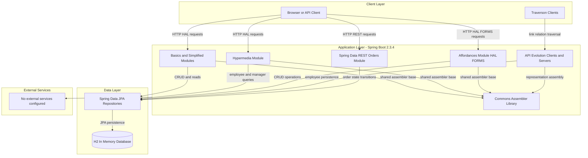
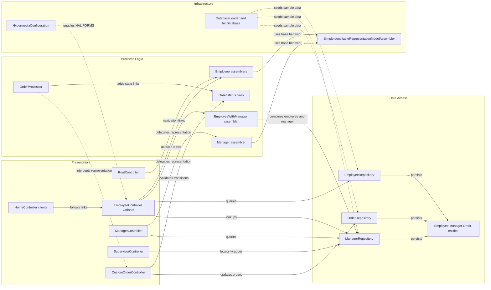

# Architecture Diagram

This repository is a multi-module Spring Boot sample application suite that demonstrates progressively richer Spring HATEOAS patterns. The modules share a small commons library and pair REST controllers with JPA-backed entities, Spring Data repositories, and hypermedia assemblers.

## Application Architecture

### Technology Stack Summary

| Layer | Technology | Version | Purpose |
|---|---|---:|---|
| Client | Browser plus Traverson | N/A | Exercises hypermedia APIs and demonstrates link-driven navigation |
| Application | Spring Boot | 2.3.4.RELEASE | Hosts the sample applications and auto-configures web plus JPA features |
| Hypermedia | Spring HATEOAS | via Spring Boot 2.3.4 | Produces HAL and HAL FORMS representations and link relations |
| Data Access | Spring Data JPA | via Spring Boot 2.3.4 | Repository abstraction for Employee, Manager, and Order persistence |
| Database | H2 | managed by Spring Boot | In-memory relational datastore for all example modules |
| Shared Library | commons module | repository local | Centralizes reusable representation assembler behavior |

### Data Storage & External Services

All runnable modules persist sample data in an embedded H2 database through Spring Data JPA repositories. The repository does not integrate with external APIs, queues, caches, or managed data services; the only networked interaction is the internal api-evolution client modules calling the companion server modules over HTTP.

### Key Architectural Decisions

- The repository is organized as independent example modules so each HATEOAS pattern can be demonstrated in isolation while reusing the shared commons assembler base.
- Hypermedia construction is centralized in representation model assemblers and processors instead of controller methods emitting raw links inline.
- The api-evolution and Spring Data REST modules demonstrate backward compatibility and state-driven affordances as architectural patterns, not just CRUD endpoints.

## Component Relationships

### Component Inventory

| Component | Layer | Type | Responsibility |
|---|---|---|---|
| RootController | Presentation | REST Controller | Exposes the top-level discovery document for the hypermedia sample |
| EmployeeController variants | Presentation | REST Controller | Serve employee collection, item, and update workflows across modules |
| ManagerController | Presentation | REST Controller | Exposes manager resources and employee-to-manager navigation |
| SupervisorController | Presentation | REST Controller | Preserves a legacy supervisor representation for compatibility |
| HomeController clients | Presentation | MVC Controller | Uses Traverson to consume server-side hypermedia APIs from the client modules |
| CustomOrderController | Presentation | BasePathAwareController | Handles explicit pay, cancel, and fulfill transitions for orders |
| Employee assemblers | Business Logic | Representation Assembler | Add self, collection, detailed, and related-resource links |
| OrderProcessor | Business Logic | RepresentationModelProcessor | Adds transition links based on current order state |
| OrderStatus rules | Business Logic | Enum rule set | Encodes valid order lifecycle transitions |
| EmployeeRepository | Data Access | CrudRepository | Persists and queries Employee entities |
| ManagerRepository | Data Access | CrudRepository | Persists and queries Manager entities |
| OrderRepository | Data Access | PagingAndSortingRepository | Persists and exposes Order entities through Spring Data REST |
| DatabaseLoader and InitDatabase | Infrastructure | Startup seeders | Populate the in-memory database with sample records on startup |
| HypermediaConfiguration | Infrastructure | Configuration | Turns on HAL FORMS support for the affordances sample |
| SimpleIdentifiableRepresentationModelAssembler | Infrastructure | Shared base class | Provides reusable self and collection link assembly logic |
