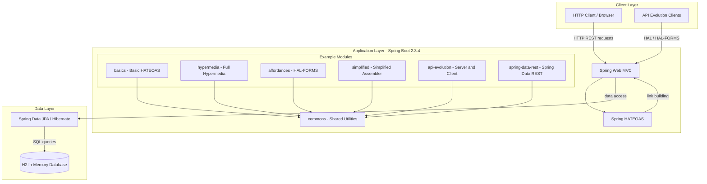
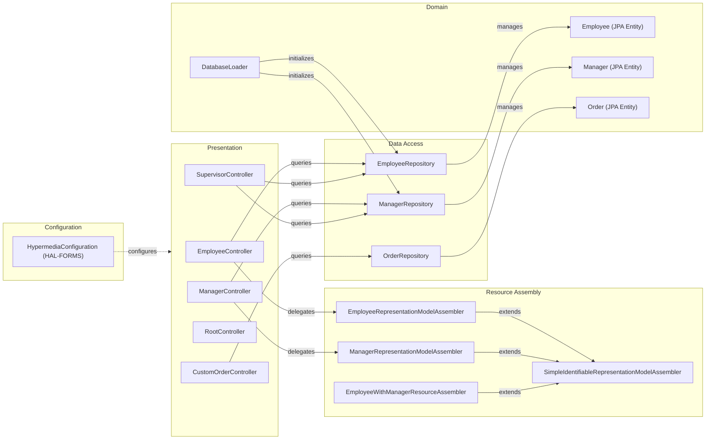

# Architecture Diagram

This document describes the architecture of the Spring HATEOAS Examples project — a multi-module Spring Boot application that demonstrates hypermedia-driven REST APIs using Spring HATEOAS.

## Application Architecture

### Technology Stack Summary

| Layer | Technology | Version | Purpose |
|-------|-----------|---------|---------|
| Presentation | Spring Web MVC | 2.3.4 (Boot-managed) | REST controller layer and HTTP handling |
| Hypermedia | Spring HATEOAS | Boot-managed | HAL, HAL-FORMS link building and resource assembly |
| Data Access | Spring Data JPA | Boot-managed | Repository abstraction over Hibernate |
| ORM | Hibernate | Boot-managed | JPA implementation |
| Database | H2 | Boot-managed | In-memory relational database for examples |
| Utilities | Lombok | Boot-managed | Boilerplate reduction (getters, setters, constructors) |
| Utilities | Evo Inflector | 1.2.2 | English word pluralization for link relation names |
| Runtime | Spring Boot | 2.3.4.RELEASE | Application hosting and auto-configuration |
| Java | Java SE | 1.8 | Language runtime |

### Data Storage & External Services

The project uses a single H2 in-memory database for all example modules, configured automatically by Spring Boot. There are no external services, message brokers, or caches. Each Spring Boot application initializes its own embedded H2 instance on startup via `CommandLineRunner` / `ApplicationListener`-based `DatabaseLoader` beans. The `spring-hateoas-and-spring-data-rest` module exposes a Spring Data REST base path at `/api` (port 9000).

### Key Architectural Decisions

- **HATEOAS-first design**: All REST resources are enriched with hypermedia links using `RepresentationModelAssembler` implementations, making APIs self-descriptive and enabling client-agnostic navigation.
- **Multi-module Maven project**: Each example is an independent Spring Boot application within its own sub-module, sharing a common `commons` library that provides `SimpleIdentifiableRepresentationModelAssembler`.
- **Embedded H2 for simplicity**: In-memory H2 database is used across all modules to keep the examples self-contained and runnable without external infrastructure.

## Component Relationships

### Component Inventory

| Component | Layer | Type | Responsibility |
|-----------|-------|------|----------------|
| EmployeeController | Presentation | REST Controller | Handles CRUD endpoints for Employee resources with HATEOAS links |
| ManagerController | Presentation | REST Controller | Handles manager retrieval and related employee lookup |
| SupervisorController | Presentation | REST Controller | Handles supervisor-level employee/manager queries |
| RootController | Presentation | REST Controller | Provides root API entry-point with discovery links |
| CustomOrderController | Presentation | BasePathAwareController | Handles order lifecycle state transitions (pay, cancel, fulfill) |
| EmployeeRepresentationModelAssembler | Resource Assembly | Component | Converts Employee entities to HAL EntityModel with links |
| ManagerRepresentationModelAssembler | Resource Assembly | Component | Converts Manager entities to HAL EntityModel with links |
| EmployeeWithManagerResourceAssembler | Resource Assembly | Component | Assembles composite EmployeeWithManager view models |
| SimpleIdentifiableRepresentationModelAssembler | Resource Assembly | Base Class (commons) | Shared base that auto-generates self and collection links |
| EmployeeRepository | Data Access | JPA Repository | Spring Data CRUD repository for Employee entities |
| ManagerRepository | Data Access | JPA Repository | Spring Data CRUD repository for Manager entities |
| OrderRepository | Data Access | JPA Repository | Spring Data CRUD repository for Order entities |
| Employee | Domain | JPA Entity | Domain object with id, firstName, lastName, role fields |
| Manager | Domain | JPA Entity | Domain object representing an employee manager |
| Order | Domain | JPA Entity | Domain object with order status state machine |
| DatabaseLoader | Domain | CommandLineRunner | Seeds H2 database with sample data on startup |
| HypermediaConfiguration | Configuration | Spring Configuration | Enables HAL-FORMS hypermedia type for affordances module |
