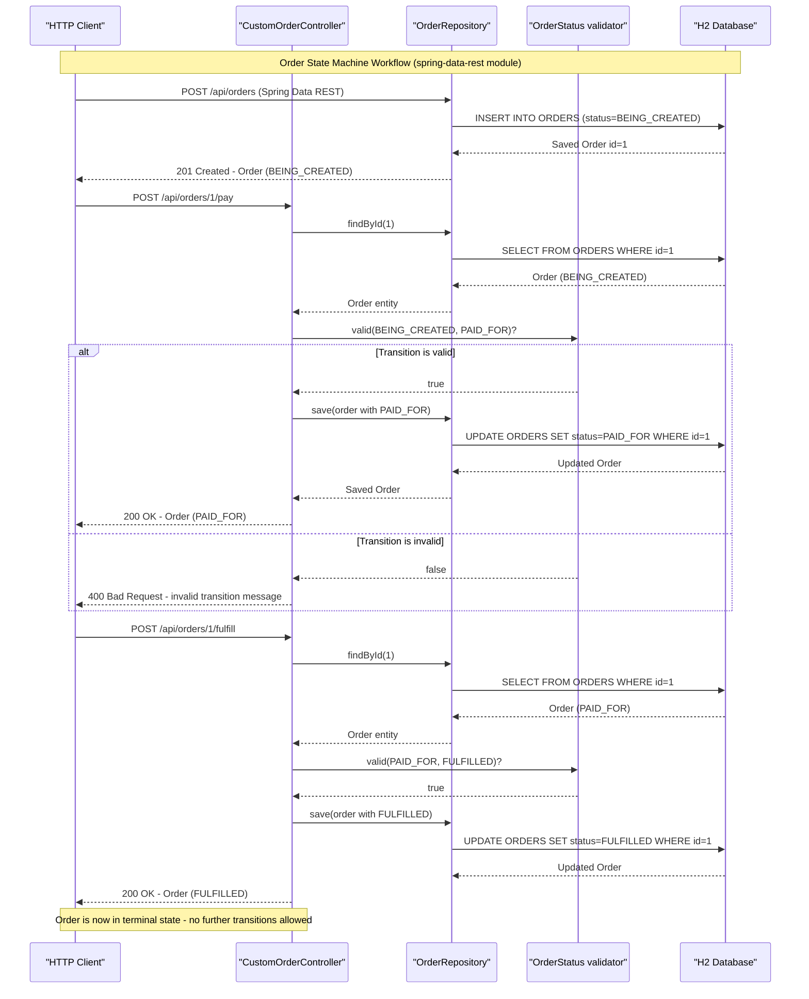

# Core Business Workflows

This project is a collection of educational example applications demonstrating hypermedia-driven REST API patterns for employee and order management, using Spring HATEOAS to enable self-describing APIs that evolve without breaking clients.

## Domain Entities

| Entity | Service / Bounded Context | Description | Key Relationships |
|--------|--------------------------|-------------|------------------|
| Employee | Employee Management (basics, hypermedia, affordances, simplified, api-evolution) | Represents a company employee with a name and role | Many-to-one with Manager (hypermedia module); standalone in other modules |
| Manager | Employee Management (hypermedia) | Represents a team manager who supervises one or more employees | One-to-many with Employee; navigable via employee link |
| EmployeeWithManager | Employee Management (hypermedia) | Composite read-model combining employee data with their manager details | Derived from Employee + Manager; used only in read operations |
| Order | Order Management (spring-data-rest) | Represents a customer order that moves through a lifecycle state machine | Standalone; no cross-entity relationships |

## Service-to-Domain Mapping

| Service | Domain Context | Owned Entities | External Dependencies |
|---------|---------------|---------------|----------------------|
| basics | Employee Management — Basic | Employee | None |
| hypermedia | Employee Management — Full | Employee, Manager, EmployeeWithManager | None |
| affordances | Employee Management — HAL-FORMS | Employee | None |
| simplified | Employee Management — Simplified | Employee | None |
| api-evolution/original-server | Employee Management — Original API | Employee (v1: firstName, lastName, role) | None |
| api-evolution/new-server | Employee Management — Evolved API | Employee (v2: firstName, lastName, role + fullName) | None |
| api-evolution/original-client | Employee Management — Client | (none owned — reads from original-server) | original-server at localhost:9000 |
| api-evolution/new-client | Employee Management — Client | (none owned — reads from new-server) | new-server at localhost:9000 |
| spring-data-rest | Order Management | Order | None |

## Primary Workflows

### Workflow 1: Browse and Retrieve Employees (Read-Only)

The simplest workflow, demonstrated in the **basics** and **hypermedia** modules. A client sends a GET request to the employees collection endpoint. The controller calls the repository to load all employees, passes the results to the model assembler, which enriches each entity with hypermedia links (self link, collection link). The enriched collection is returned as an `application/hal+json` document. A client follows the self link on any individual employee to retrieve that specific employee's full details, including links to related resources.

Steps:
1. Client discovers API via root link (hypermedia module) or directly requests `/employees`
2. Controller retrieves all employees from JPA repository
3. Model assembler adds `_links.self` and `_links.employees` to each item
4. Client follows links to navigate to individual employee or manager details

### Workflow 2: Create and Update Employees (Full CRUD)

Demonstrated in the **simplified** and **affordances** modules. A POST to `/employees` creates a new employee; the response includes a `Location` header pointing to the new resource's self link. A PUT to `/employees/{id}` replaces an existing employee's data; the response returns a `Location` header with the updated resource link.

Steps:
1. Client POSTs employee payload to `/employees`
2. Controller saves entity via JPA repository
3. Response body contains EntityModel with self link; `Location` header set to new resource URI
4. Client may follow the Location link to retrieve the created/updated resource

### Workflow 3: Navigate Manager-Employee Relationships (Hypermedia)

Unique to the **hypermedia** module. The API exposes navigable links between employees and their managers in both directions:
- From a manager: GET `/managers/{id}/employees` returns all employees under that manager
- From an employee: GET `/employees/{id}/manager` returns the employee's manager
- The root endpoint (`/`) returns discovery links pointing to employees, managers, and detailed views

Steps:
1. Client fetches `/` to discover available link relations
2. Client follows `_links.managers` to browse managers
3. Client follows `_links.employees` on a manager resource to see the manager's team
4. Client follows `_links.manager` on an employee resource to see who manages them

### Workflow 4: Order State Machine Transitions

Unique to the **spring-data-rest** module. An Order starts in `BEING_CREATED` status. Business rules enforce which status transitions are valid. State transitions are triggered via dedicated POST endpoints and are validated before any change is persisted.

Valid transitions:
- `BEING_CREATED` → `PAID_FOR` (pay action)
- `BEING_CREATED` → `CANCELLED` (cancel action)
- `PAID_FOR` → `FULFILLED` (fulfill action)
- `FULFILLED` → (terminal — no further transitions)
- `CANCELLED` → (terminal — no further transitions)

Steps:
1. Order is created via Spring Data REST with initial status `BEING_CREATED`
2. Client POSTs to `/api/orders/{id}/pay`, `/api/orders/{id}/cancel`, or `/api/orders/{id}/fulfill`
3. `CustomOrderController` retrieves the Order and calls `OrderStatus.valid(current, requested)` to validate the transition
4. If valid: status is updated and the updated Order is saved and returned (200 OK)
5. If invalid: 400 Bad Request is returned with a descriptive error message

### Workflow 5: API Evolution — Backward-Compatible Client-Server Interaction

Demonstrated across **api-evolution** module pairs. The new server adds a `fullName` derived field to the Employee resource. The original client uses `@JsonIgnoreProperties(ignoreUnknown = true)` and HAL link traversal, so it continues to work correctly against the new server without any code change — it simply ignores the unknown `fullName` field. This demonstrates that HATEOAS-based clients are insulated from non-breaking server-side API additions.

## Cross-Service Data Flows

The only cross-service data flow in this project is in the **api-evolution** module pair. The client application calls the server over HTTP using a HAL-aware `RestTemplate` (configured by `HypermediaRestTemplateConfigurer`). The client does not use hardcoded URL paths for data navigation — it follows hypermedia links from the server's responses, making the client resilient to path changes.

There is no API gateway aggregation across multiple backend services. The hypermedia module's `EmployeeWithManager` view model is the closest analogue — it combines Employee and Manager data within a single JVM process using JPA relationships, not inter-service HTTP calls. No circuit breaker or fallback behavior applies.

## Business Workflow Sequence



## Business Rules & Decision Logic

### Validation Rules

- **Order state transition validation** (`OrderStatus.valid`): Encodes all valid state transitions in a single static method. Invalid transitions return `false`, causing the controller to return HTTP 400 with a descriptive message. No Spring validation annotations (`@Valid`, `@NotNull`) are used on entity fields.
- **Employee deserialization**: `@JsonIgnoreProperties(ignoreUnknown = true)` on Employee entities allows clients to silently ignore unknown JSON fields added by newer server versions, enabling backward-compatible API evolution without breaking existing clients.

### State Transitions (Order lifecycle)

```
BEING_CREATED --[pay]--> PAID_FOR
BEING_CREATED --[cancel]--> CANCELLED
PAID_FOR --[fulfill]--> FULFILLED
FULFILLED --> (terminal)
CANCELLED --> (terminal)
```

### Business Constraints

- **No duplicate prevention**: No uniqueness constraints are declared on Employee or Order entities beyond the auto-generated primary key.
- **No capacity or temporal constraints**: No booking windows, quantity limits, or time-bounded rules are implemented.
- **Derived field for API evolution** (`Employee.getFullName()`): Returns `firstName + " " + lastName` as an additional read-only field. Because of `@JsonIgnoreProperties`, old clients ignore this field when POSTing data back, preventing data corruption.

### Transactions

No explicit `@Transactional` annotations appear in controller or service code. Spring Data JPA repository methods run within Spring's default transaction management. Each repository `save()` call is transactional by default.

### Error Handling

- **Order not found**: `OrderNotFoundException` is thrown when `findById` returns empty; controllers return an appropriate error response.
- **Invalid URI construction**: `URISyntaxException` is caught in the simplified and affordances controllers when building the `Location` header, returning 400 Bad Request with an error message.
- **Invalid state transition**: Returns HTTP 400 with a plain-text message describing the invalid transition.

### Audit / Logging

No audit trail, business event logging, or change-tracking mechanisms are implemented.

### Authorization

No business-level authorization rules, role-based access control, or `@PreAuthorize` annotations are present. All endpoints are publicly accessible.
