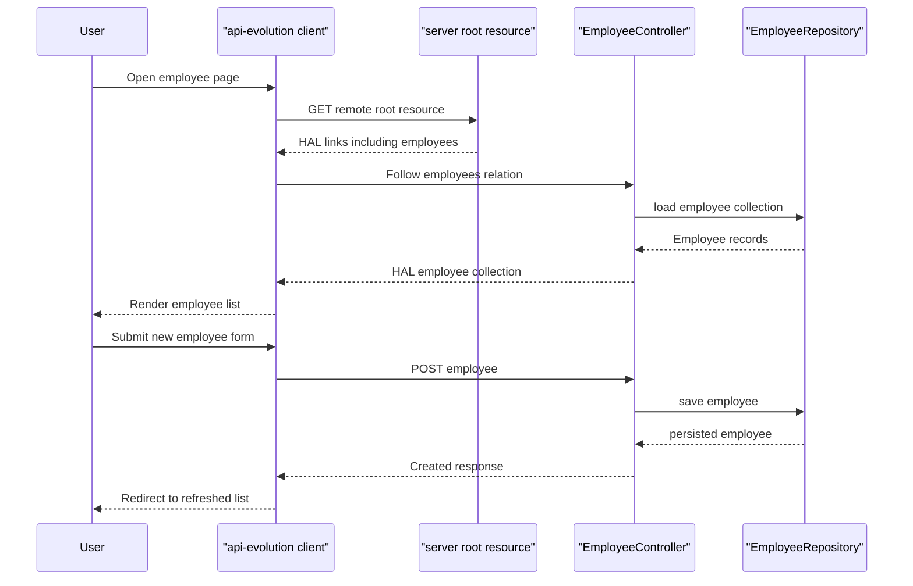

# Core Business Workflows

The application domain is a suite of sample business flows that show how users and clients navigate, mutate, and discover resources in a hypermedia-driven system. The most meaningful workflows revolve around employee browsing, order state transitions, and client-side link traversal during API evolution.

## Domain Entities

| Entity | Service / Bounded Context | Description | Key Relationships |
|---|---|---|---|
| Employee | Employee Management modules | Core business record representing a person exposed through hypermedia APIs | Belongs to a manager in the hypermedia sample; appears in list, item, and detailed views |
| Manager | Hypermedia module | Supervisory record used to demonstrate related-resource navigation | Owns one or more employees |
| Supervisor | Hypermedia compatibility layer | Legacy-facing supervisor representation built from manager data | Mirrors manager relationships for older consumers |
| Order | Order Processing module | Stateful business record used to demonstrate affordance-driven lifecycle transitions | Moves through creation, payment, fulfillment, and cancellation states |
| OrderStatus | Order Processing module | Business state machine for order lifecycle decisions | Governs which transitions and links are valid |

## Service-to-Domain Mapping

| Service | Domain Context | Owned Entities | External Dependencies |
|---|---|---|---|
| basics | Employee browsing | Employee | Shared commons assembler base |
| simplified | Employee maintenance | Employee | Shared commons assembler base |
| hypermedia | Employee and manager relationships | Employee, Manager, Supervisor view | Shared commons assembler base |
| affordances | Employee CRUD with affordances | Employee | Shared commons assembler base |
| api-evolution original-server | Original employee API | Employee | Shared commons assembler base |
| api-evolution new-server | Evolved employee API | Employee | Shared commons assembler base |
| api-evolution original-client | Employee UI consumer | Remote Employee contract | Calls original-server over HTTP with Traverson |
| api-evolution new-client | Employee UI consumer | Remote Employee contract | Calls new-server over HTTP with Traverson |
| spring-hateoas-and-spring-data-rest | Order lifecycle management | Order, OrderStatus | Spring Data REST plus shared Spring Boot infrastructure |

## Primary Workflows

### Workflow 1: Browse employees through hypermedia discovery

A client begins at the hypermedia module root document, follows the published `employees` or `managers` link relation, and navigates between employee and manager resources without constructing URLs manually. Representation assemblers add the related links that keep the workflow discoverable, including a legacy `supervisor` relation for backward compatibility.

### Workflow 2: Maintain employees with affordances or simplified CRUD

A user or client submits employee create and update requests to the simplified or affordances modules. The application persists the entity through the repository layer and responds with resource locations or updated hypermedia documents, while the affordances module additionally advertises allowed operations through HAL FORMS templates.

### Workflow 3: Execute order state transitions

The Spring Data REST module creates and exposes orders, then allows users to pay, cancel, or fulfill them through custom transition endpoints. Each transition first checks the current `OrderStatus`; valid transitions update the status and return the order, while invalid transitions return a bad request response instead of mutating state.

### Workflow 4: Consume an evolved API through Traverson

The api-evolution clients first fetch the remote root resource from the server module running on port 9000, then follow the `employees` relation to load the current collection. When a user submits a new employee form, the client posts to the discovered employee collection resource and redirects back to the home view.

## Cross-Service Data Flows

The only true cross-process flow in the repository is the api-evolution client-to-server interaction, where the client modules retrieve the root resource from the remote server, follow the `employees` relation, and then submit new employee data back to the same service. Within the hypermedia module, employee and manager data are composed inside one service boundary to create `EmployeeWithManager` responses and navigational manager lookups. There is no circuit breaker or resilience fallback logic; if a remote api-evolution server is unavailable, the client workflow simply cannot complete.

## Business Workflow Sequence

## Business Rules & Decision Logic

- `OrderStatus` defines the key business rule set: `BEING_CREATED` orders may be paid or canceled, `PAID_FOR` orders may be fulfilled, and terminal states do not accept further transitions.
- Representation assemblers are part of the user-visible workflow because they decide which links and affordances users see next, including legacy supervisor navigation and detailed employee-manager views.
- Startup data loaders are important for business behavior in every sample because they create the example records that make each workflow demonstrable immediately after launch.
- Business-level authorization, approval flows, and distributed transactions are not implemented; these modules are focused on discoverability and state-transition examples rather than enterprise policy enforcement.
