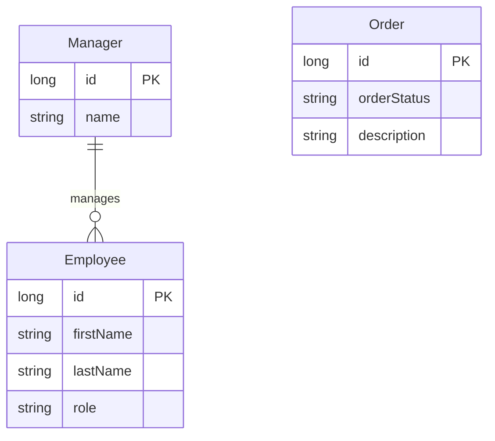

# Data Architecture & Persistence Layer

The repository uses a small relational model centered on employees, managers, and orders, all persisted through Spring Data JPA into embedded H2 databases. Data persistence is intentionally lightweight because these modules are examples of hypermedia patterns rather than large multi-service data domains.

## Database Configuration

| Service/Module | DB Type | Profile | Driver | Connection | Migration Tool |
|---|---|---|---|---|---|
| basics | H2 in-memory | default | H2 managed by Spring Boot | Auto-configured embedded datasource | None |
| simplified | H2 in-memory | default | H2 managed by Spring Boot | Auto-configured embedded datasource | None |
| hypermedia | H2 in-memory | default | H2 managed by Spring Boot | Auto-configured embedded datasource | None |
| affordances | H2 in-memory | default | H2 managed by Spring Boot | Auto-configured embedded datasource | None |
| api-evolution original-server | H2 in-memory | default | H2 managed by Spring Boot | Auto-configured embedded datasource | None |
| api-evolution new-server | H2 in-memory | default | H2 managed by Spring Boot | Auto-configured embedded datasource | None |
| spring-hateoas-and-spring-data-rest | H2 in-memory | default | H2 managed by Spring Boot | Auto-configured embedded datasource | None |

## Data Ownership per Service

| Service | Tables Owned | ORM Framework | Caching | Notes |
|---|---|---|---|---|
| basics | Employee | Spring Data JPA and Hibernate | None | Startup loader seeds employee records |
| simplified | Employee | Spring Data JPA and Hibernate | None | Same employee model with create and update behavior |
| hypermedia | Employee, Manager | Spring Data JPA and Hibernate | None | Manager-to-employee relationship powers detailed and navigational views |
| affordances | Employee | Spring Data JPA and Hibernate | None | Same core employee entity exposed with HAL FORMS affordances |
| api-evolution original-server | Employee | Spring Data JPA and Hibernate | None | Original server contract for the client modules |
| api-evolution new-server | Employee | Spring Data JPA and Hibernate | None | Evolved employee contract while preserving compatibility |
| spring-hateoas-and-spring-data-rest | ORDERS / Order | Spring Data JPA and Hibernate | None | Order lifecycle is exposed through Spring Data REST and custom transitions |

## Entity Model

## Key Repository Methods

| Service | Repository | Notable Methods | Purpose |
|---|---|---|---|
| basics | EmployeeRepository | inherited CRUD methods | Basic employee persistence and lookup |
| simplified | EmployeeRepository | inherited CRUD methods | Employee create, read, and update workflow support |
| hypermedia | EmployeeRepository | `findByManagerId(Long managerId)` plus inherited CRUD methods | Supports manager-to-employee navigation and detailed employee views |
| hypermedia | ManagerRepository | inherited CRUD methods | Manager lookup for related-resource assembly |
| affordances | EmployeeRepository | inherited CRUD methods | Full CRUD persistence for HAL FORMS sample |
| api-evolution original-server | EmployeeRepository | inherited CRUD methods | Original server employee operations |
| api-evolution new-server | EmployeeRepository | inherited CRUD methods | Evolved server employee operations |
| spring-hateoas-and-spring-data-rest | OrderRepository | inherited paging and CRUD methods | Backing repository for Spring Data REST order endpoints |

## Caching Strategy

No explicit caching strategy is configured. The repository does not declare cache providers, cache annotations, second-level Hibernate cache settings, or cache-aside patterns; every request uses repository access directly against the embedded in-memory database.

## Data Ownership Boundaries

Each runnable module owns its own small in-memory datastore and does not share a database with the other example applications at runtime. The main cross-component data relationships stay inside a single module, especially the hypermedia module where `Employee` records reference `Manager` records, and the Spring Data REST module where `Order` state transitions are enforced within the same persistence boundary. The api-evolution clients do not read databases directly; they access employee data only through the server modules' HTTP APIs.

### Data Classification & Sensitivity

| Entity | Sensitive Fields | Classification (PII/PHI/PCI/None) | Controls in Place |
|---|---|---|---|
| Employee | firstName, lastName | PII | No encryption, masking, or field-level access controls detected |
| Manager | name | PII | No encryption, masking, or field-level access controls detected |
| Order | description | None | No additional controls required by the sample model |
