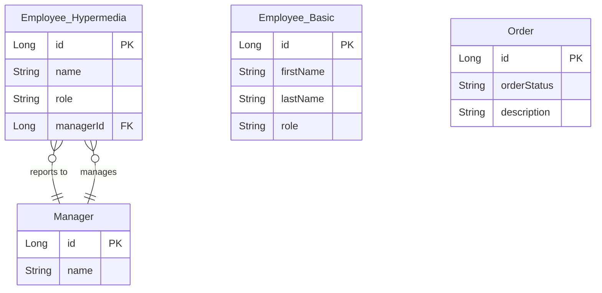

# Data Architecture & Persistence Layer

This project uses Spring Data JPA backed by an embedded H2 in-memory database across all modules, with 3 distinct entity types (Employee, Manager, Order) spread across independent Spring Boot applications.

## Database Configuration

| Service/Module | DB Type | Profile | Driver | Connection | Migration Tool |
|---------------|---------|---------|--------|-----------|---------------|
| basics | H2 in-memory | default (all) | H2 (Boot-managed) | Embedded, auto-configured | None — Hibernate ddl-auto creates schema; DatabaseLoader seeds data via CommandLineRunner |
| hypermedia | H2 in-memory | default (all) | H2 (Boot-managed) | Embedded, auto-configured | None — Hibernate ddl-auto creates schema; DatabaseLoader seeds data via CommandLineRunner |
| affordances | H2 in-memory | default (all) | H2 (Boot-managed) | Embedded, auto-configured | None — Hibernate ddl-auto creates schema; DatabaseLoader seeds data via CommandLineRunner |
| simplified | H2 in-memory | default (all) | H2 (Boot-managed) | Embedded, auto-configured | None — Hibernate ddl-auto creates schema; DatabaseLoader seeds data via CommandLineRunner |
| api-evolution/original-server | H2 in-memory | default (all) | H2 (Boot-managed) | Embedded, auto-configured | None — Hibernate creates schema; InitDatabase seeds data via ApplicationListener |
| api-evolution/new-server | H2 in-memory | default (all) | H2 (Boot-managed) | Embedded, auto-configured | None — Hibernate creates schema; InitDatabase seeds data via ApplicationListener |
| spring-data-rest | H2 in-memory | default (all) | H2 (Boot-managed) | Embedded, auto-configured | None — Hibernate creates schema on startup |

See `configuration-inventory.md` for the full property inventory per module.

## Data Ownership per Service

| Service | Tables Owned | ORM Framework | Caching | Notes |
|---------|-------------|--------------|---------|-------|
| basics | EMPLOYEE | Hibernate (via Spring Data JPA) | None | Simple Employee CRUD; no manager relationship |
| hypermedia | EMPLOYEE, MANAGER | Hibernate (via Spring Data JPA) | None | Bidirectional OneToMany Manager-Employee; OneToOne Employee-Manager |
| affordances | EMPLOYEE | Hibernate (via Spring Data JPA) | None | Full CRUD; HAL-FORMS affordances |
| simplified | EMPLOYEE | Hibernate (via Spring Data JPA) | None | Full CRUD via SimpleIdentifiableRepresentationModelAssembler |
| api-evolution/original-server | EMPLOYEE | Hibernate (via Spring Data JPA) | None | Original API schema: firstName, lastName, role |
| api-evolution/new-server | EMPLOYEE | Hibernate (via Spring Data JPA) | None | Evolved API schema; backward-compatible fields |
| spring-data-rest | ORDERS | Hibernate (via Spring Data JPA) | None | Order state machine; table name overridden to ORDERS |

## Entity Model

## Key Repository Methods

| Service | Repository | Notable Methods | Purpose |
|---------|-----------|----------------|---------|
| basics, affordances, simplified | EmployeeRepository extends CrudRepository | findAll(), findById(Long), save(Employee), deleteById(Long) | Standard CRUD inherited from CrudRepository |
| hypermedia | EmployeeRepository extends CrudRepository | findByManagerId(Long id) | Retrieves all employees belonging to a specific manager (derived query) |
| hypermedia | ManagerRepository extends CrudRepository | findByEmployeesId(Long id) | Navigates the OneToMany/OneToOne JPA relationship to find a Manager from an Employee id |
| api-evolution (both servers) | EmployeeRepository extends CrudRepository | findAll(), findById(Long), save(Employee) | Standard CRUD inherited from CrudRepository |
| spring-data-rest | OrderRepository extends CrudRepository | findAll(), findById(Long), save(Order) | Standard CRUD; Spring Data REST auto-exposes collection and item resources |

## Caching Strategy

No caching layer is configured in any module. There are no `@Cacheable`, `@CacheEvict`, or `@EnableCaching` annotations, and no cache provider (EhCache, Redis, Caffeine, etc.) is declared as a dependency. All data reads go directly to the H2 in-memory database. Given that H2 operates in-process and in-memory, query latency is negligible for the example workloads; caching is not needed for this educational project.

## Data Ownership Boundaries

Each Spring Boot module maintains its own isolated H2 in-memory database instance. There is no shared database server — each application starts its own embedded H2 engine at runtime and the data does not persist between restarts. This database-per-service model (enforced by the embedded runtime) means there is no cross-service data access at the database level. All cross-module data composition (e.g., the `EmployeeWithManager` view model in the hypermedia module) is done within the same JVM process via JPA relationships rather than inter-service HTTP calls.

The api-evolution client modules are the only services that access data owned by another service (the server modules), and they do so exclusively through the REST API using HAL link traversal via `RestTemplate`.

### Data Classification & Sensitivity

| Entity | Sensitive Fields | Classification | Controls in Place |
|--------|----------------|---------------|------------------|
| Employee (basics/affordances/simplified) | firstName, lastName | PII (personal names) | None — no encryption-at-rest, masking, or field-level access control configured |
| Employee (hypermedia) | name | PII (personal name) | None — no encryption-at-rest, masking, or field-level access control configured |
| Employee (api-evolution) | firstName, lastName, role | PII (personal names) | None — no encryption-at-rest, masking, or field-level access control configured |
| Manager (hypermedia) | name | PII (personal name) | None — no encryption-at-rest, masking, or field-level access control configured |
| Order (spring-data-rest) | description | None identified | N/A |

Employee and Manager entities store basic personal names (PII). No encryption-at-rest, data masking, audit logging, or field-level access controls are implemented. Because all data is held only in-memory (H2) and the applications are educational examples, the exposure risk is limited to the runtime process, but any migration to a persistent database would require adding appropriate PII controls.
