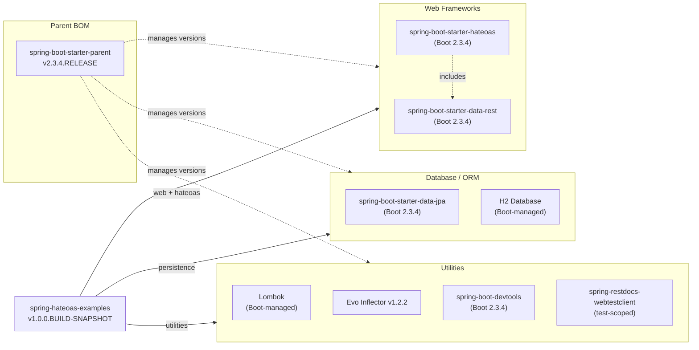

# Dependency Map

The Spring HATEOAS Examples project is a multi-module Maven application with 8 modules sharing a common parent POM. The project declares approximately 8 runtime/compile dependencies at the root level, plus module-specific additions.

## Dependencies

### Dependency Summary

| Category | Count | Key Libraries | Notes |
|----------|-------|--------------|-------|
| Web Frameworks | 2 | spring-boot-starter-hateoas, spring-boot-starter-data-rest | HATEOAS used project-wide; data-rest only in spring-data-rest module |
| Database / ORM | 2 | spring-boot-starter-data-jpa, H2 | In-memory H2; no production database configured |
| Utilities | 3 | Lombok, Evo Inflector 1.2.2, spring-boot-devtools | Evo Inflector has an explicit version; others are BOM-managed |

### Version & Compatibility Risks

The project is built on Spring Boot **2.3.4.RELEASE**, which reached end-of-life in November 2021. Spring Boot 2.x itself reached EOL in November 2023. The underlying Java version target is **Java 8**, which is in long-term support but behind current LTS releases (Java 17, 21). The H2 database is configured only as an in-memory store, which is appropriate for examples but is not production-ready. Evo Inflector **1.2.2** is pinned explicitly; upgrading Spring Boot would require verifying compatibility with the newer version of this library. The `spring-boot-devtools` dependency is included in compile scope, which is normally scoped to runtime/dev only.

### Notable Observations

- **Spring Boot 2.3.4.RELEASE is end-of-life**: Both Spring Boot 2.x and Spring Framework 5.x have reached EOL. The project should be migrated to Spring Boot 3.x (Spring Framework 6.x) targeting Java 17+.
- **No production database**: All modules rely exclusively on H2 in-memory storage. A real deployment would require a persistent datastore (e.g., PostgreSQL, MySQL).
- **javax.persistence vs jakarta.persistence**: The project uses `javax.persistence` annotations (Java EE), which are renamed to `jakarta.persistence` in Spring Boot 3.x / Jakarta EE 9+. This is a breaking change requiring source code updates.
- **spring-boot-devtools in default scope**: The `spring-boot-devtools` dependency is declared without a `<scope>runtime</scope>` or `<optional>true</optional>` qualifier in the parent POM, which may inadvertently package it into production JARs.

## Test Dependencies

| Framework | Version | Notes |
|-----------|---------|-------|
| spring-boot-starter-test | Boot-managed (2.3.4) | Includes JUnit 5, Mockito, AssertJ, Spring Test |
| spring-restdocs-webtestclient | Boot-managed | Used only in spring-hateoas-and-spring-data-rest module for REST documentation tests |

Total test-scope dependencies: 2

The project uses the standard Spring Boot test slice (`@SpringBootTest`, `@WebMvcTest`) provided by `spring-boot-starter-test`, which bundles JUnit 5, Mockito, and AssertJ. No separate contract-testing or integration test framework (e.g., Testcontainers, Pact) is present. `spring-restdocs-webtestclient` is included in only one module for generating API documentation snippets.
