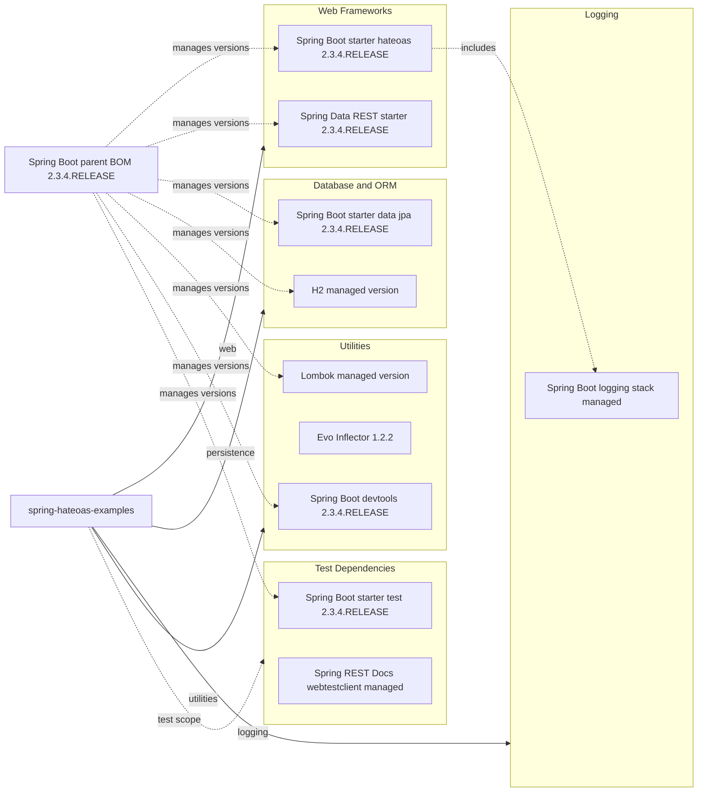

# Dependency Map

This multi-module Maven project declares a compact dependency set centered on Spring Boot and Spring HATEOAS. The primary external footprint is shared across the example modules, with one module adding Spring Data REST and REST Docs support.

## Dependencies

### Dependency Summary

| Category | Count | Key Libraries | Notes |
|---|---:|---|---|
| Web Frameworks | 2 | Spring Boot starter hateoas, Spring Data REST starter | Hypermedia support is shared; Spring Data REST is module-specific |
| Database / ORM | 2 | Spring Boot starter data jpa, H2 | All examples persist to an embedded relational store |
| Logging | 1 | Spring Boot logging stack | Managed transitively by Spring Boot starters |
| Security | 0 | None | No Spring Security dependency is declared |
| Observability | 0 | None | No actuator or metrics dependencies are declared |
| Utilities | 3 | Lombok, Evo Inflector, Spring Boot devtools | Utility set is small and mostly development-oriented |

### Version & Compatibility Risks

The project is pinned to Spring Boot 2.3.4.RELEASE and Java 8, both of which are well behind current long-term-support baselines and align with the mandatory Java upgrade findings in the generated assessment report. Lombok is also sensitive to newer JDKs in this environment, as shown by the pre-existing local build failure on JDK 17.

### Notable Observations

- The parent POM centralizes almost all dependency management through the Spring Boot parent BOM, which keeps module declarations small.
- The only explicit non-Spring utility version is `org.atteo:evo-inflector:1.2.2`, used to pluralize link relations in the shared commons assembler.
- There is no separate caching, messaging, security, or observability stack, so modernization work is likely to focus on platform and runtime concerns rather than dependency sprawl.
- The `spring-hateoas-and-spring-data-rest` module is the only module that adds Spring REST Docs alongside the shared test stack.

## Test Dependencies

| Framework | Version | Notes |
|---|---|---|
| Spring Boot starter test | 2.3.4.RELEASE | Provides the core JUnit, Mockito, AssertJ, and Spring test support |
| Spring REST Docs webtestclient | managed by Spring Boot 2.3.4 | Declared only in the Spring Data REST integration module |

Total test-scope dependencies: 2

The repository has established Maven-based test infrastructure, but the local baseline run in this environment currently fails before tests execute because Lombok is incompatible with the active JDK 17 module boundaries.
